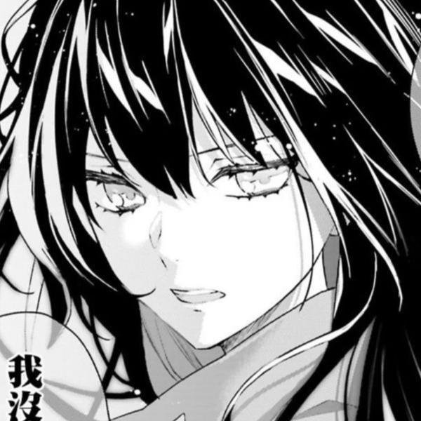

  

<h1 align="center">HUNTER THE D3V</h1>

<b>a random brazilian developer that is known for not being the smartest one</b>

  Currently working on Themr and Discraft

  

<h2 align="center">About</h2>

<table align="center" width="90%">
  <tr>
    <td align="center" bgcolor="#0d0000" style="color: white; border-radius: 12px; padding: 20px;">
      

          - hi, my name is Nicolas (but you can call me Hunter) 👋🎩   
          - i'm a learning young dev from brazil 🟩🟨🟦   
          - been working with code since 2016 👨‍💻💻   
          - i like to code, football and to play some videogames 🖥⚽🎮
      

    </td>
  </tr>
</table>

  

